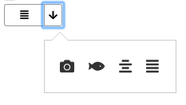

# React IconPicker

## Screen Capture




## Usage

```js
import * as React from 'react';
import IconPicker from 'react-icon-picker';

const icons = [
  'fas fa-camera',
  'fas fa-fish',
  'fas fa-align-center',
  'fas fa-align-justify'
];

const App = () => {

  const [state, setState] = React.useState({
    icon: ''
  });

  return (<>
    <span className={state.icon}></span>
    <IconPicker 
      icons={icons} 
      defaultValue="fas fa-camera" 
      onChange={(icon) => {
        setState({
          ...state,
          icon
        })
      }}
    />
  </>);
}
```